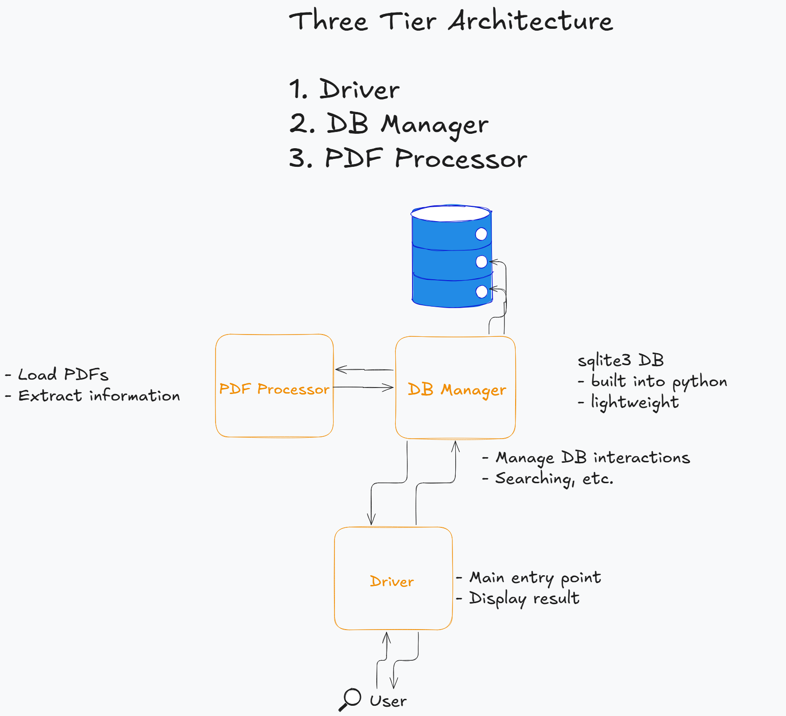

# PDF Document Manager

## Description

This is my attempt at Ekai's assignment for Python SDE position. All the details of the assignment are in the [Assignment.pdf](Assignment.pdf) file.

## Prerequisites

- Python 3.8 or higher
- pip
- virtualenv (optional)

## Project Structure

```bash
project/
├── app.py
├── src/
│   ├── __init__.py
│   ├── main.py
│   ├── db_manager.py
│   └── pdf_processor.py
├── data/
│   ├── documents.db
│   └── *.pdf
├── scripts/
│   └── init_db.py
└── requirements.txt
```

## Installation

1. Clone the repository to your local machine.

2. Navigate to the project directory and create a virtual environment:

```bash
cd project-directory
python -m venv venv
source venv/bin/activate  # On Windows: venv\Scripts\activate
```

3. Install the required packages using the following command (virtual environment is recommended):

```bash
pip install -r requirements.txt
```

## Usage

There are 4 pdfs in the `data` directory, which also contains the db file. In case you want to add more pdfs in the data directory, you can do so. The application will store the documents in the database.

If you want a fresh start, you can delete the `documents.db` file in the `data` directory. Then, you can run the following command to create a new database:

```bash
python scripts/init_db.py
```

Run the following command to start the application:

```bash
python main.py
```

When you start the application, you will be presented with a menu with the following options:

1. Store new documents from PDFs

2. Search by date

3. Search by date and security level

4. View all stored documents

5. Clear database

6. Exit

You can select any of the options by entering the corresponding number. The application will prompt you in case of any errors.

The first recommended step is to store the documents from the PDFs. You can do this by selecting the first option. The application will store the documents in the database.

All the testcases prescribed in the [Assignment.pdf](Assignment.pdf) file have been implemented and can be verified by running the corresponding inputs. The application will display the results on the console.

## Future Improvements

1. Implement batch processing for large numbers of PDFs

2. Stronger search capabilities

3. Better metadata handling

## Architecture



The architecture here is simple. It is a three-tier architecture with the following components:

1. Driver
2. DB Manager
3. PDF Processor

Each component has its own responsibility. The driver is responsible for the user interface and interaction. The DB Manager is responsible for handling the database operations. The PDF Processor is responsible for processing the PDFs and extracting the required information.

Each component is separate and can be replaced with a different implementation. This makes the application modular, extensible, and maintainable.
